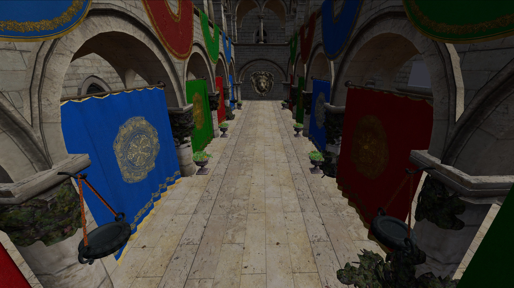

# Vulkan Renderer
Made to explore modern Vulkan 1.4 rendering techniques, coming from OpenGL. Loads and renders glTF scenes, focusing on dynamic rendering, timeline semaphores, and bindless resources.

The plan is to grow this into an optimized engine handling both voxel terrain and conventional meshes, picking up where my [OpenGL renderer](https://github.com/ValaraAra/Voxel-Engine) left off.

## Features
- Resources
	- Bindless Textures (Descriptor Indexing)
	- Buffer Device Address
		- Vertices, Transforms, and Materials Fetched in the Vertex Shader
	- VMA Memory Allocation
- Rendering
	- Dynamic Rendering
	- Vertex Pulling
	- Multi-Draw-Indirect
		- Single Indirect Draw Call
- Synchronization
	- Timeline Semaphores for Frames-in-Flight
	- Synchronization2 Barriers
- Assets
	- glTF Loading (tinygltf)

# Acknowledgements
Learned from the wonderful Vulkan YouTube series by [constref](https://www.youtube.com/@constref1983) and the well-known guide and samples by [Sascha Willems](https://github.com/SaschaWillems/Vulkan).